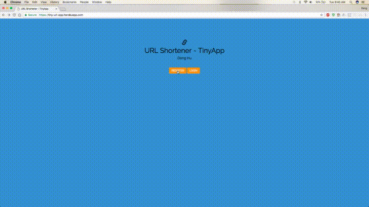

# TinyURL Shortener App

An application that replicates URL shortening services like Bitly and TinyURL, this Tiny URL Shortener Clone allows users to register, log in, and create shortened versions of long URLs. (like bit.ly and tinyURL)

Built with Node and Express.

# Demo
* https://tiny-url-app.herokuapp.com/

## Getting Started
* Git clone the repository
* Install all dependencies (using the `npm install` command).
* Run the development web server using the `node express_server.js` command.

## Final Product

## Features
* Login page with user authentication and flash messages
* Page that displays list of tiny URLS user has submitted, permitting the user to edit their tinyURLS
* Page that allows users to update their long URLs

## Dependencies

* Node.js
* Express
* EJS
* bcrypt
* body-parser
* cookie-session
